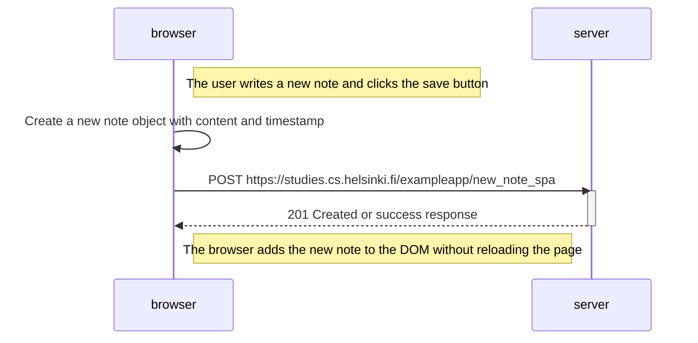

```mermaid
sequenceDiagram
    participant browser
    participant server

    Note right of browser: The user writes a new note and clicks the save button

    browser->>browser: Create a new note object with content and timestamp
    browser->>server: POST https://studies.cs.helsinki.fi/exampleapp/new_note_spa
    activate server
    server-->>browser: 201 Created or success response
    deactivate server

    Note right of browser: The browser adds the new note to the DOM without reloading the page
```
